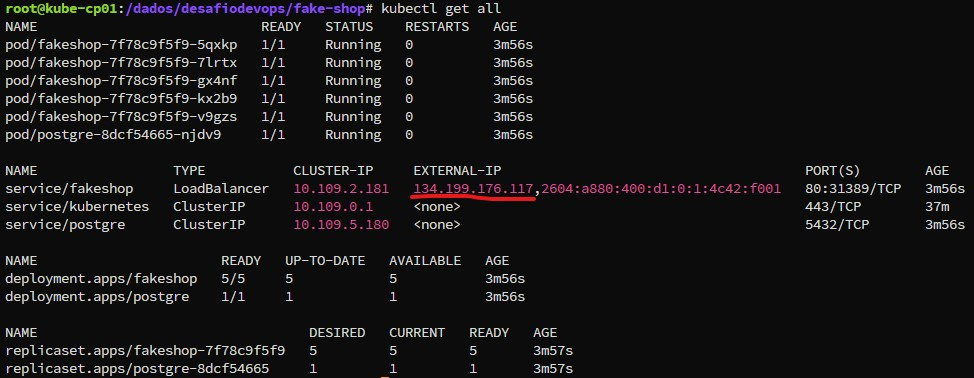

# Fake Shop
## Instruções de Execução
Configurar as variaveis de ambiente, conforme abaixo

### Variáveis de Ambiente
#### Banco de Dados - PostgreSQL
POSTGRES_PASSWORD => Adicionar password para o banco PostgreSQL.

POSTGRES_USER => Usuário do banco de dados.

POSTGRES_DB => Nome do database do banco de dados.

#### Aplicação
DB_HOST	=> Host do banco de dados PostgreSQL.

DB_USER => Nome do usuário do banco de dados PostgreSQL.

DB_PASSWORD	=> Senha do usuário do banco de dados PostgreSQL.

DB_NAME	=>	Nome do banco de dados PostgreSQL.

FLASK_APP => Configurar aquivo index.py

### Configurar Manifesto
- Acessar diretório k8s e alterar arquivo deployment.yaml, substituindo as variaveis acima referente a cada deployment.

### Aplicar Deployment
- Após baixar o repo para local onde tenha comunicação via kubectl com o ambiente kubernetes, executar o comando abaixo:

        kubectl apply -f k8s/deployment.yaml

## Esteira CI/CD
### CI

        jobs:
          CI:
            runs-on: ubuntu-latest
            steps:
              - name: Obtendo codigo
                uses: actions/checkout@v4.2.2
              - name: Login to Docker Hub
                uses: docker/login-action@v3
                with:
                  username: ${{ secrets.DOCKERHUB_USERNAME }}
                  password: ${{ secrets.DOCKERHUB_TOKEN }}
              - name: Construcao e envio da imagem docker
                uses: docker/build-push-action@v6
                with:
                  context: ./src
                  push: true
                  file: ./src/Dockerfile
                  tags: |
                    andrepoletti/fake-shop:v${{ github.run_number }}
                    andrepoletti/fake-shop

### CD

            CD:
              needs: [CI]
              runs-on: ubuntu-latest
              steps:
                - name: Obtendo codigo
                  uses: actions/checkout@v4.2.2
                - name: Setando Contexto Kubernetes
                  uses: azure/k8s-set-context@v4
                  with:
                    method: kubeconfig
                    kubeconfig: ${{ secrets.KUBECONFIG_DIGITALOCEAN_2 }}
                - name: Fazendo Deploy no Cluster Kubernetes
                  uses: Azure/k8s-deploy@v5
                  with:
                    manifests: |
                      k8s/deployment.yaml
                    images: |
                      andrepoletti/fake-shop:v${{ github.run_number }}

## Funcionamento Esteira CI/CD e Aplicação em Execução
### Antes da execução da esteira

## Inicio execução

## Final execução

## Detalhes CI

## Detalhes CD

## Resultado comando kubectl get all no ambiente DO

## Aplicação funcionando

